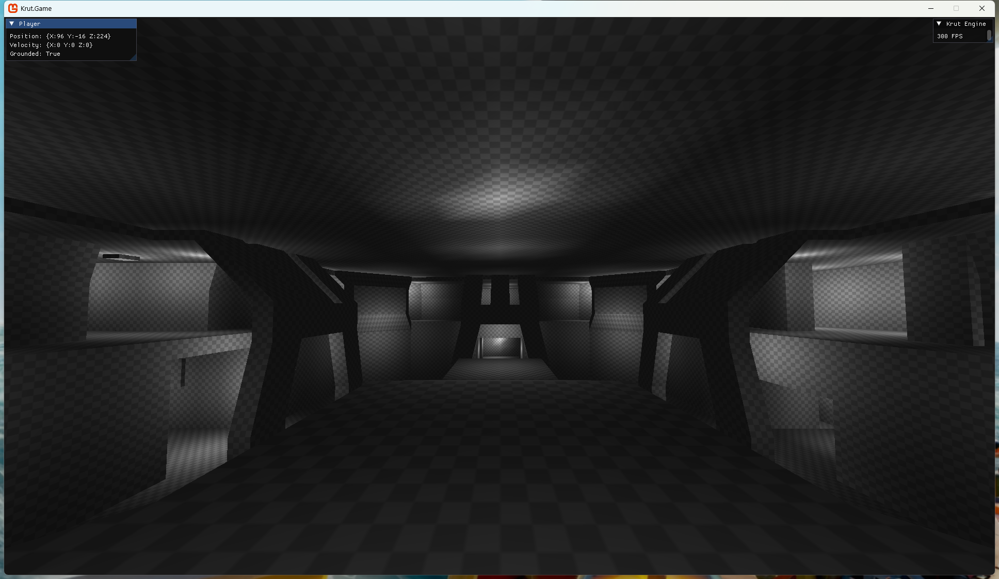
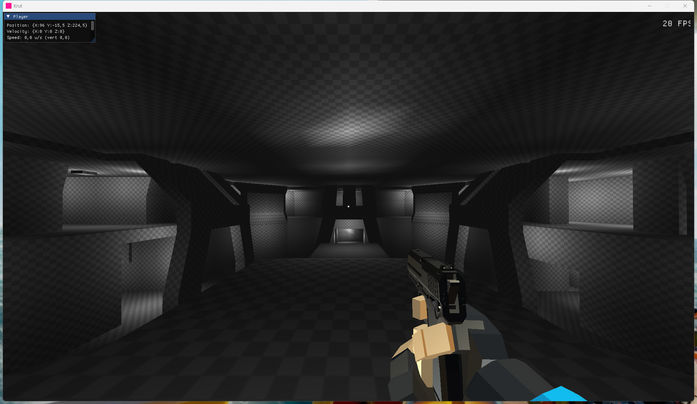
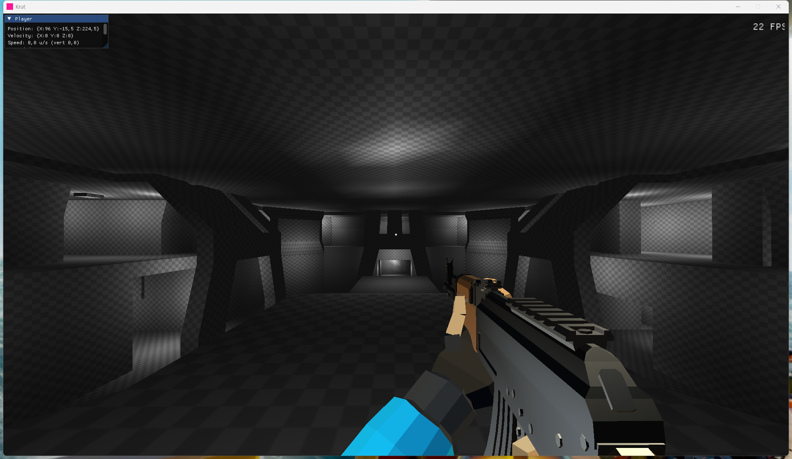
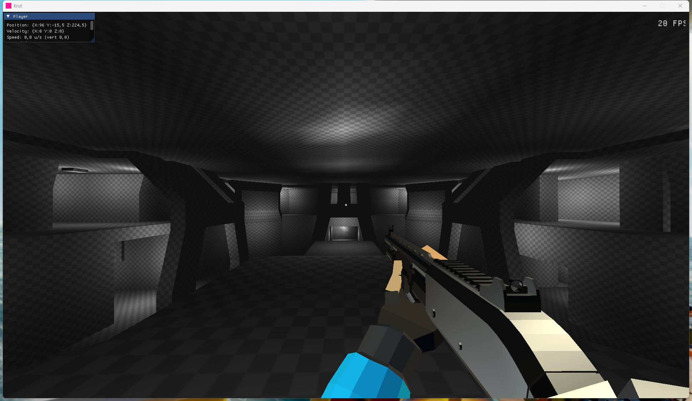
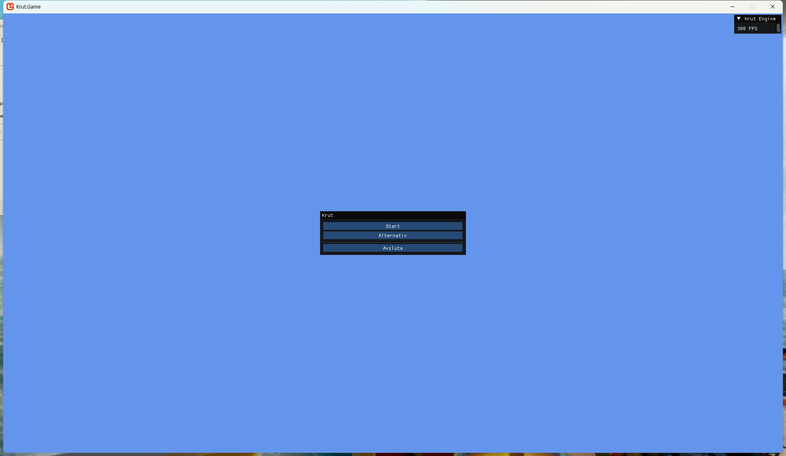
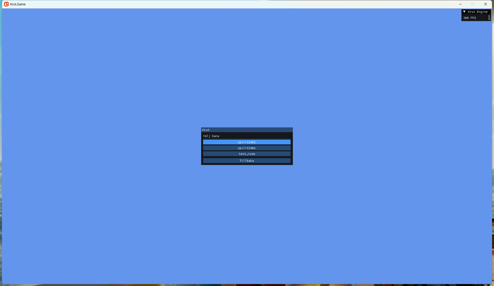
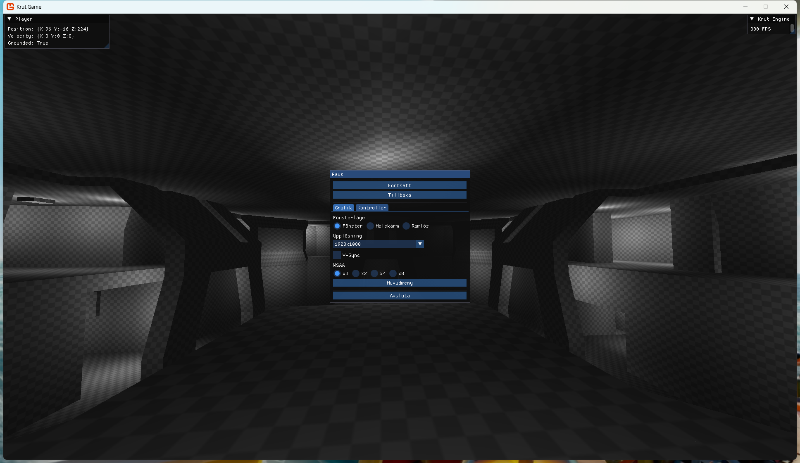
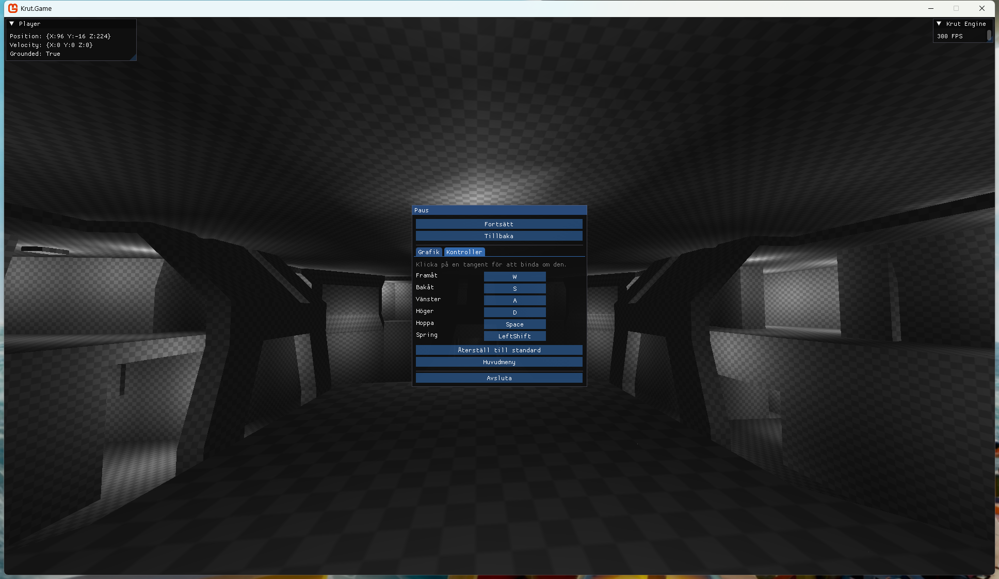

# Krut Engine

An FPS game engine built from scratch in C#/MonoGame, with [TrenchBroom](https://trenchbroom.github.io/) as the level editor. Solo project, early development.

## Tech stack

| Part | Used for |
|---|---|
| [.NET 9](https://dotnet.microsoft.com/) / C# | Platform and language |
| [MonoGame](https://monogame.net/) (DesktopGL) | Window, graphics device, input, game loop |
| [Sledge.Formats.Map](https://github.com/LogicAndTrick/sledge-formats) | Reads TrenchBroom/Quake `.map` files (brushes, faces, entities) |
| [Sledge.Formats.Bsp](https://github.com/LogicAndTrick/sledge-formats) | Reads compiled Quake/GoldSrc `.bsp` files (geometry, embedded textures, baked lightmaps) |
| [ImGui.NET](https://github.com/ImGuiNET/ImGui.NET) | Debug overlay, main menu, pause menu, options |
| [SharpGLTF](https://github.com/vpenades/SharpGLTF) | Skeletal animation for rigged glTF models (CPU skinning, no custom shader) |
| [DotRecast](https://github.com/ikpil/DotRecast) | Recast/Detour navmesh generation and pathfinding queries (C# port), used for enemy AI |
| Native AOT | Publishes to a single small `.exe` with no `.NET` runtime required on the target machine |

## Subsystem status

A rough, honest self-assessment of how far each part of the engine is from what a complete singleplayer-campaign engine needs. Movement and build/deploy are close to done; the AI framework itself is solid too now (blocked mainly on art, not code). The entity/scripting layer has real trigger-driven logic now (target/targetname), but moving/kinematic geometry (doors, platforms) is still a separate, unbuilt piece.

| Subsystem | Status | Missing |
|---|---|---|
| Movement | ~95% | Most polished subsystem |
| Build & deploy | ~90% | Native AOT + asset packing both work well |
| Collision | ~85% | Static geometry only — no moving/kinematic objects (doors, platforms), no dynamic rigid-body physics |
| Weapon/animation framework | ~85% | Deep and general, but only built and tuned against 3 weapons |
| Asset pipeline | ~75% | Works well (loose files or packed, glTF, `.map`/`.bsp`), but no `.pak` encryption, no packaging tooling, no hot-reload |
| Rendering & lighting | ~70% | No dynamic sun/shadows, no post-processing, no culling/LOD |
| UI & settings | ~70% | Solid menu/pause/options, but it's all ad hoc ImGui calls — no general widget/HUD framework for future screens |
| Save/load | ~20% | Only settings are persisted — no framework for saving/loading actual game state |
| Audio | ~25% | Just fire-and-forget `SoundEffect.Play()` for weapons — no 3D positional audio, no ambient/music engine, no central audio manager |
| Entity/scripting layer | ~35% | Classic Quake/Half-Life target/targetname trigger→activate framework works (trigger volumes can remove a named entity) — but no moving/kinematic geometry yet, so real doors/buttons/platforms aren't possible until that's built |
| AI/pathfinding framework | ~65% | Framework itself is solid (real navmesh pathfinding, 4-state FSM, working hit detection) — mainly blocked on art (rigged/animated enemy models) and content (only one enemy type, no ranged enemies, no encounter/wave design or difficulty tuning) rather than code |

## What it can do right now

**Levels**
- Reads both TrenchBroom `.map` source files and compiled Quake/GoldSrc `.bsp` files — the same level can be iterated on in TrenchBroom or dropped in as a finished `.bsp`, both end up as the same neutral brush/entity data internally
- Reads entities (class name + all properties + origin) — `info_player_start` places the player's spawn point/direction. Brushes belonging to `trigger_*` entities are recognized as non-solid logic volumes and excluded from collision/rendering, instead of being treated as ordinary solid geometry
- Textures load per material name from a `Textures/` folder (PNG) first; `.bsp` files fall back to their own embedded textures (miptex + palette) if no loose override exists; a still-missing texture falls back to a procedural checkered placeholder so surfaces stay distinguishable
- Lighting: a `.bsp`'s own baked lightmaps are read and used directly. For `.map` sources without baked lighting, `light` entities (Quake/TrenchBroom convention) are baked into per-vertex lighting with distance falloff instead — large faces are subdivided first so the gradient stays smooth instead of only showing up at the corners. A map's `_sun_ambient`/`_ambient` worldspawn property sets a global base brightness (capped so it never washes out the point lights). Maps with no lighting data at all fall back to flat directional shading instead of going black
- Levels can ship either as loose files or packed into a single `assets.pak` archive next to the executable — the engine picks whichever is present, so a dev build (loose files, easy to hot-swap) and a shipped build (one packed file) both work with the same code

**Player**
- Half-Life 1-style movement: ground/air acceleration and friction (not an instant velocity snap), sprint, crouch, and air-strafing that lets speed build up beyond the ground max — strafejumping/bunnyhopping works
- Crouch and sprint each have their own "hold" or "toggle" behavior, switchable per-binding in the options menu; crouching lowers the collision box, eye height, and move speed, and won't stand back up if there isn't clear headroom
- Automatic step-climbing: small ledges/stairs (up to a configurable step height) are climbed without jumping, with the camera smoothly catching up to the new height instead of snapping — walking down stairs is smoothed the same way
- Collision is built from the exact same triangulated geometry the renderer draws (not simplified brush planes), so what's solid always matches what's visible, including for non-convex or oddly-shaped brushes
- A free-flying spectator camera also exists in the engine for flying around levels during development

**Models & weapons**
- Rigged glTF models (`.glb`) play back skeletal animation via SharpGLTF.Runtime — the engine re-skins every vertex on the CPU each frame from the current animation pose, so no custom GPU shader or content-pipeline step is needed
- Three real first-person weapons (pistol, rifle, shotgun) — full arms + gun, switchable with `1`/`2`/`3`, reload on `R`, with idle/walk/run picked automatically from the player's own speed and sprint state
- Firing (left mouse button) with real ammo — magazine + reserve per weapon, semi-auto for pistol/shotgun (one click, one shot) and full-auto for the rifle (hold to fire), reload pulls from reserve into the magazine; each weapon fires at its own fixed RPM instead of being tied to its animation length
- Every shot raycasts against the level's collision geometry and leaves a small decal where it hits — the shotgun fires 10 pellets in a spread cone instead of a single ray
- Recoil (vertical kick + horizontal drift) and a short screen shake per shot, both independently tunable per weapon — the shake is visual-only and never affects where shots actually land
- Gunfire and reload sound effects, layered instead of cut off — rapid rifle fire doesn't mute its own previous shots
- The weapon is rendered with its own, narrower field of view than the world, so long guns don't look stretched at the world's wide FOV — a standard trick borrowed from classic FPS engines
- Animation changes (drawing a weapon, switching between idle/walk/run, reloading) crossfade instead of snapping, blending the actual skinned vertex positions between the old and new pose over a short window

**Combat & AI**
- A generic entity framework (`Entity`/`EntityWorld`), engine-level and not enemy-specific, so future props/pickups can be built on the same foundation instead of being special-cased
- One enemy type so far (melee), following the same base/subclass pattern as the weapon system — health, speed, attack range/damage, etc. are overridable per enemy type instead of duplicated or branched with `if`s
- A simple 4-state AI (Idle → Chase → Attack, plus a Search state that goes to the last-seen position before giving up) driven by line-of-sight raycasts, with horizontal and vertical attack range checked independently so an enemy at the foot of a staircase doesn't "attack" through the floor
- Real pathfinding: a Recast/Detour polygon navmesh (via the DotRecast C# port), built once per level from the exact same collision geometry everything else uses — enemies path around obstacles and up stairs instead of walking straight at the player
- The player has health, takes damage from enemy attacks, and respawns at the map's start point on death
- Weapon fire is entity-aware — every shot tests against enemy hitboxes first (closest of world geometry or an entity wins), not just world decals — enemies flash white for a moment on every registered hit as visual confirmation
- A dev-only spawn tool (`Mouse 5`, raycasts to wherever you're looking) for quickly testing enemies without a dedicated level-editor entity yet

**Scripting**
- Classic Quake/Half-Life `target`/`targetname` convention: a trigger volume (`trigger_once`/`trigger_multiple`, placed and named in TrenchBroom/J.A.C.K.) activates every entity whose `targetname` matches its `target` — no hardcoded link between a specific trigger and a specific effect
- Any entity can opt in by implementing a generic `ITargetable` interface; enemies are the first user (a trigger can remove/kill a named enemy — a common scripted-event/safe-zone pattern), not something baked into the trigger itself
- A small `.fgd` file describes the engine's custom entity classes (spawn points, triggers, lights) so TrenchBroom/J.A.C.K. show the right fields and link lines instead of raw, hand-typed key/value pairs

**UI & settings**
- Main menu automatically lists every level file found (`.map` or `.bsp`, loose or packed) — no code changes needed to add a new one
- A minimal Steam-style FPS counter (just the number, no window chrome) sits in the corner during gameplay, updated once a second so it's actually readable
- A small crosshair dot sits in the center of the screen during gameplay, with an ammo counter (magazine / reserve) in the bottom-right corner
- Pause menu (Escape, only available once a level is running — it does nothing on the main menu): Resume / Options / Main Menu / Quit
- Options has three tabs:
  - **Graphics**: window mode (windowed/fullscreen/borderless), resolution, V-Sync, MSAA (x0/x2/x4/x8)
  - **Controls**: click a binding and press a new key to rebind it (Esc cancels), a hold/toggle checkbox next to Sprint and Crouch, and a "Reset to defaults" button that covers all of it
  - **Audio**: a single master volume slider
- All settings are saved automatically to `Saves/settings.json` next to the executable and reloaded on next launch
- `-map <name>` command-line argument skips straight to a level, for launching from TrenchBroom's own "Launch Engine" tool during map testing
- A "Loading…" screen (with a spinner) covers level loading instead of the window just freezing — `StartGame` is a heavy blocking call (rebuilds the world renderer, collision, and navmesh from scratch)

**Performance**
- Uncapped frame rate (V-Sync optional via the menu)
- GPU-skinned weapon viewmodels (bone matrices only, not per-vertex, uploaded per frame)
- Mipmapped, anisotropically filtered textures (no shimmering at a distance)
- Publishes with Native AOT: a single ~18 MB folder (`Game.exe` + a packed `assets.pak`), no `.NET` install required to run
- The weapon arms/gun rigs are CPU-skinned every frame; that's cheap enough in an optimized build but can get slow in an unoptimized Debug build — run with `-c Release` (see below) if framerate looks off during development

## Screenshots

| Pistol | Rifle | Shotgun |
|---|---|---|
|  |  |  |

| Main menu | Level list |
|---|---|
|  |  |

| Graphics options | Controls options |
|---|---|
|  |  |

## Not done yet

- Directional/"sun" lighting and shadows for `.map` sources without baked lightmaps (only point lights + a flat ambient term, no shadow casting)
- Trigger volumes can activate named entities now (target/targetname), but there's no moving/kinematic geometry yet — no real doors, buttons, or platforms, just the activation plumbing they'd eventually use
- No aim-down-sights yet
- Visual effects — bullet-hole decals exist, but no particles, muzzle flashes, or explosions
- AI: the framework (navmesh pathfinding, FSM, hit detection) works well, but only one melee enemy type exists, with a placeholder (unrigged) model — no ranged enemies, no rigged/animated enemy models, no encounter/wave design or difficulty tuning
- Ragdolls — no physics-driven death/hit reactions, characters would just be static or animation-only
- Encrypting `assets.pak` (currently a plain zip — openable with any archive tool)
